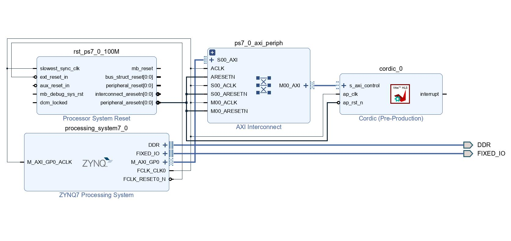

# CORDIC算法硬件加速核

本项目为2022 Xilinx暑期学校DSP任务，基于pp4fpgas中的cordic项目进行重构和改进。

## 一、HLS设计

HLS顶层函数`cordic()`的核心C代码如下：
```c
void cordic(THETA_TYPE theta, COS_SIN_TYPE &sine, COS_SIN_TYPE &cosine)
{
    //设置初始向量：阶cordic算法的增益分之一
    COS_SIN_TYPE current_cos = INIT_COS;
    COS_SIN_TYPE current_sin = 0;
    //每次的偏移量
    COS_SIN_TYPE cos_shift, sin_shift;
    // for循环迭代计算
    for (int i = 0; i < NUM_ITERATIONS; i++)
    {
    	cos_shift = current_cos >> i;
    	sin_shift = current_sin >> i;
    	if (theta >= 0)
    	{
    		current_cos = current_cos - sin_shift;
    		current_sin = cos_shift + current_sin;
    		theta = theta - cordic_angles[i];
    	}
    	else
    	{
    		current_cos = current_cos + sin_shift;
    		current_sin = current_sin - cos_shift;
    		theta = theta + cordic_angles[i];
    	}
    }
    //输出三角函数值
    cosine = current_cos;
    sine = current_sin;
}
```

 - 代码的关键之处有：
     - 进行15轮CORDIC运算
     - THETA_TYPE、COS_SIN_TYPE均使用vitis HLS的`ap_fixed.h`头文件提供的定点数格式，采用`ap_fixed<28,8>`（8位整数、20位小数）
     - 每一轮旋转的偏移量通过将当前的x/y值向右移位实现
     - 旋转方向通过多路选择器实现

 - 此外，代码中加入`#pragma`编译指令，指定输入、输出端口为Axilite协议，并将代码中的for循环设置为`UNROLL`铺开模式，以加快运算速度
     - 设置端口的`#pragma`指令：

    ```c
    #pragma HLS INTERFACE s_axilite port=theta
    #pragma HLS INTERFACE s_axilite port=sine
    #pragma HLS INTERFACE s_axilite port=cosine
    #pragma HLS INTERFACE s_axilite port=return
    ```

     - 设置数组存储模式和循环展开的`#pragma`指令：

    ```c
    #pragma HLS ARRAY_PARTITION variable=cordic_angles dim=0
    #pragma HLS unroll
    ```

 - 编写testbench进行C仿真，将cordic函数和math库的三角函数对`theta=0~89`90个角度的计算结果进行比对，可发现计算误差为$10^{-5}$数量级，部分结果如下图所示：

<div align=center>

</div>

 - 综合后将代码综合、联合仿真，最终导出IP核。

## 二、Vivado中搭建系统框架

在Vivado中添加上述导出的IP核，并添加Zynq PS7等配套模块，将CORDIC IP与PS相连接，连接后的系统如下：

<div align=center>

</div>

## 三、Jupyter中编写python代码

在Vivado中导出bitstream和hw handoff后，在Jupyter中加载该Overlay，通过直接读写寄存器和编写上层驱动的方式分别测试CORDIC Overlay，具体代码见相关Jupyter Notebook。

 - 值得注意的是，由于HLS代码中使用了定点数格式，而python中无法自动识别定点格式，需直接读写二进制数，即：写入时应使用`0b`二进制格式，读取的也是对应二进制整数转换而成的十进制数。

     - $\theta=45^{\circ}$时的输入格式如下：

    ```
    theta = 0b0010_1101_0000_0000_0000_0000_0000    #45°的定点数表示
    ```

     - $cos(\theta)$的输出值为`741444`，转换为二进制为`0b0000_0000_1011_0101_0000_0100_0100`，接近$\frac{\sqrt{2}}{2}$的值